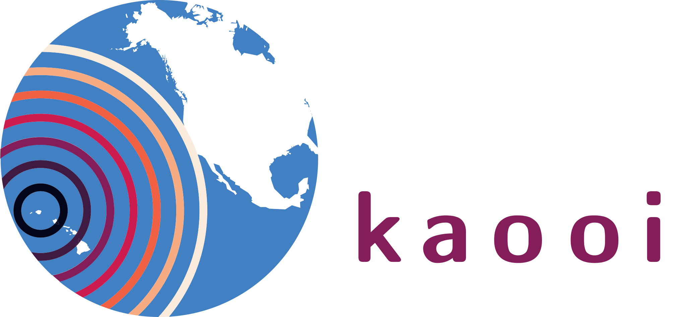

<!-- SPHINX-START -->

code for signal processing and analysis of the kauai beacon recieved by Ocean Observatories Innitiative (OOI) hydrophones

I'm currently developing this code and it isn't quite ready to start being versioned or easily packaged up for others to use.
If this code is useful to your research or you would like to use it, feel free to reach out!
